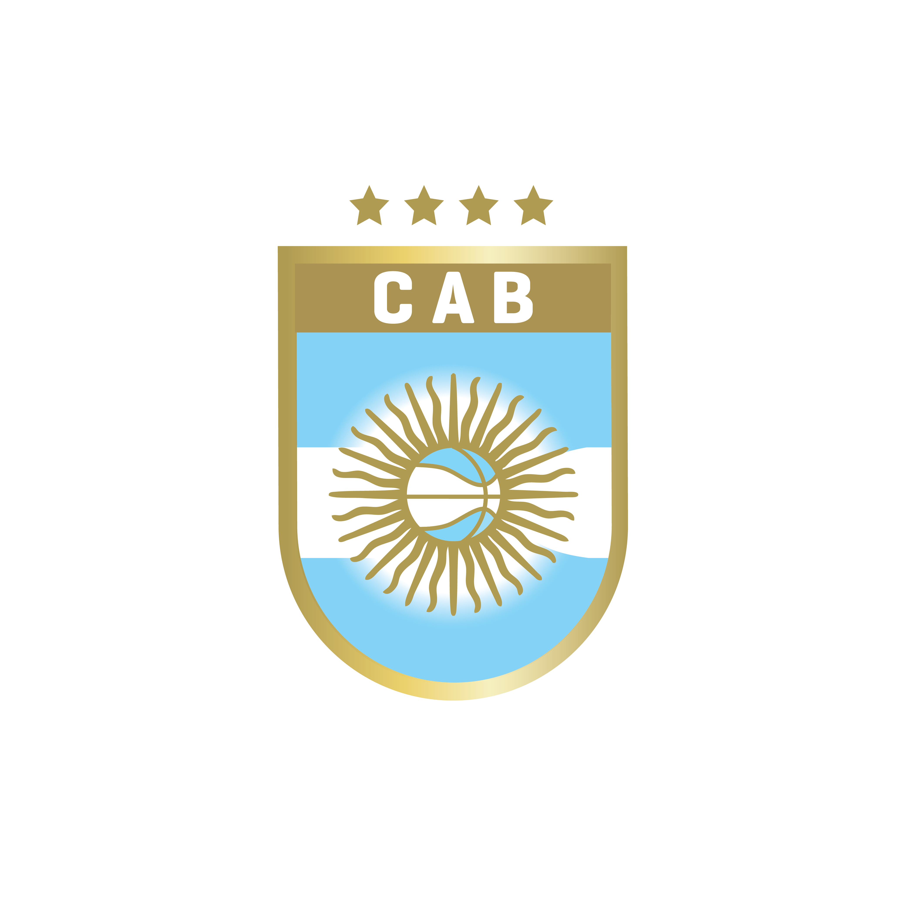

<div style="text-align: center;">
    
</div>

# Análisis Biomecnico Postural CAB 🏀

Plataforma web interactiva desarrollada con Streamlit para el análisis biomecánico de posturas clave en jugadores de baloncesto, utilizando MediaPipe para la estimación de pose.

---

## 🎯 Objetivo del Proyecto

Esta herramienta permite a preparadores físicos, entrenadores y atletas:

1. **Visualizar** 8 posturas de evaluación biomecánica estandarizadas.
2. **Subir** imágenes de atletas realizando estas posturas.
3. **Obtener** un análisis visual (esqueleto MediaPipe) superpuesto en la imagen subida.
4. **Recibir** un informe de texto con los ángulos biomecánicos relevantes calculados para la postura seleccionada.
5. **Descargar** tanto la imagen con el esqueleto como el informe de texto.

El objetivo es proporcionar una herramienta **rápida, accesible y visual** para identificar posibles desbalances, asimetrías o limitaciones de movilidad, facilitando la toma de decisiones en el entrenamiento y la prevención de lesiones.

---

## ✨ Características (MVP Actual)

* **Autenticación Simple:** Sistema de login basado en archivo `users.csv`.
* **Selección de Postura Intuitiva:** Interfaz de cuadrícula con imágenes clickables (`streamlit-image-select`) para las 8 posturas.
* **Carga de Imágenes:** Permite subir archivos JPG, JPEG o PNG para cada postura.
* **Estimación de Pose:** Utiliza **MediaPipe Pose** (`model_complexity=2`) para detectar 33 landmarks corporales.
* **Análisis Biomecánico:** Calcula ángulos articulares clave específicos para cada una de las 8 posturas (ej. flexión de rodilla, inclinación pélvica, dorsiflexión).
* **Visualización del Esqueleto:** Superpone los landmarks detectados y las conexiones óseas sobre la imagen subida.
* **Informe de Ángulos:** Genera un archivo de texto (`.txt`) con los valores numéricos de los ángulos calculados.
* **Descarga Separada:** Permite descargar la imagen con el esqueleto (PNG) y el informe de texto (TXT) de forma independiente.
* **Interfaz Responsiva:** Diseñada con Streamlit para adaptarse a diferentes tamaños de pantalla.

---

## 🛠️ Tecnologías Utilizadas

* **Lenguaje:** Python 3.10+
* **Framework Web:** Streamlit
* **Estimación de Pose:** MediaPipe (Pose)
* **Procesamiento de Imagen:** OpenCV, Pillow (PIL)
* **Manejo de Datos:** Pandas (para `users.csv`)
* **UI Component:** streamlit-image-select

---

## 🚀 Instalación y Ejecución

1. **Clonar el Repositorio:**
   ```bash
   git clone [URL_DEL_REPOSITORIO]
   cd [NOMBRE_DEL_DIRECTORIO]
   ```
2. **Crear Entorno Virtual (Recomendado):**
   ```bash
   python -m venv venv
   source venv/bin/activate  # Linux/macOS
   # venv\Scripts\activate    # Windows
   ```
3. **Instalar Dependencias:**
   ```bash
   pip install -r requirements.txt
   ```
4. **Ejecutar la Aplicación:**
   ```bash
   streamlit run app.py
   ```
5. **Abrir en el Navegador:** La terminal indicará la URL local (normalmente `http://localhost:8501`).

---

## 📋 Guía de Uso

1. **Login:** Ingresa tus credenciales definidas en `users.csv`.
2. **Menú Principal:** Verás una cuadrícula con las 8 posturas de evaluación. Pasa el cursor sobre ellas para ver un ligero zoom (hover). Haz clic en la imagen de la postura que deseas analizar.
3. **Vista de Detalle:**
   * Verás el título de la postura y una descripción de su objetivo y métricas clave.
   * Utiliza el botón **"Sube tu Imagen"** para cargar una foto del atleta realizando esa postura.
   * La aplicación procesará la imagen automáticamente.
   * Se mostrará la **imagen con el esqueleto** detectado por MediaPipe.
   * Debajo, aparecerán dos botones de descarga:
     * **"Descargar Imagen":** Guarda la imagen con el esqueleto superpuesto (formato PNG).
     * **"Descargar Texto":** Guarda un archivo `.txt` con los ángulos calculados y el objetivo de la evaluación.
   * Usa el botón **"⬅️ Volver"** para regresar al menú principal y analizar otra postura.
   * Usa el botón **"🚪 Salir"** para cerrar la sesión y volver a la pantalla de login.

---

## biomechanics: Las 8 Posturas Evaluadas

Esta aplicación analiza 8 posturas fundamentales del screening FMS (Functional Movement Screen) adaptado o evaluaciones similares, cruciales para detectar patrones de movimiento disfuncionales:

1. **Vista Anterior (Estática):** Simetría general, alineación MMII.
2. **Vista Sagital (Estática):** Curvaturas columna, alineación vertical.
3. **Vista Posterior (Estática):** Escápulas, alineación retropié.
4. **Sentadilla OHS (Frontal):** Valgo dinámico, shift pélvico.
5. **Sentadilla OHS (Sagital):** Profundidad, movilidad tobillo/cadera, estabilidad core.
6. **Sentadilla OHS (Posterior):** Confirmación shift, pronación, elevación talones.
7. **Sentadilla Unipodal (Izq):** Estabilidad funcional izquierda (glúteo medio).
8. **Sentadilla Unipodal (Der):** Estabilidad funcional derecha y asimetría.

*(Consulta la sección de explicaciones dentro de la app para ver los detalles biomecánicos y ángulos específicos de cada una)*

---

## 🔮 Futuras Mejoras (MVP 2 y más allá)

* **Visualización de Ángulos:** Dibujar los ángulos calculados directamente sobre la imagen del esqueleto.
* **Feedback Visual:** Colorear líneas o ángulos según si están dentro o fuera de rangos normales (Verde/Amarillo/Rojo).
* **Análisis Comparativo:** Guardar análisis previos (en base de datos o localmente) para comparar evolución del atleta.
* **Análisis de Video:** Extender la funcionalidad para analizar secuencias de video en lugar de imágenes estáticas.
* **Autenticación Robusta:** Reemplazar `users.csv` por un sistema de autenticación más seguro (ej. base de datos, OAuth).
* **Base de Datos de Atletas:** Crear perfiles para almacenar y gestionar los análisis de múltiples jugadores.

---

¡Esperamos que esta herramienta sea de gran utilidad para el desarrollo y cuidado de nuestros atletas!
